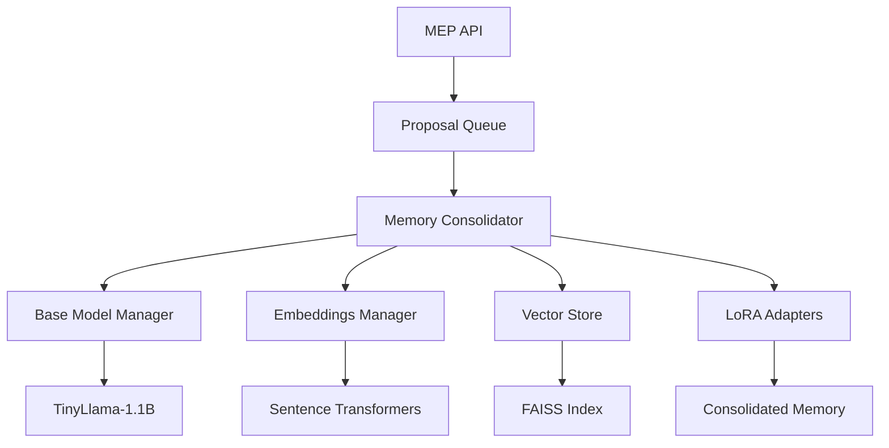

# SC Memory System MVP

**Revolutionary memory consolidation system for LLMs that reduces token usage by 50-90% through parameter-level memory consolidation using adapters (LoRA/Prefix Tuning).**

[](https://www.python.org/downloads/)
[](https://fastapi.tiangolo.com/)
[](https://pytorch.org/)
[](LICENSE)

## 🚀 Overview

SC (Sistema de Consolidación) is a groundbreaking memory system that transforms how LLMs handle conversation context. Instead of repeatedly injecting the same context tokens, SC consolidates conversation experiences into learned model weights using lightweight adapters.

### Core Innovation

- **Memory Consolidation**: Convert conversation experiences into model weights rather than context tokens
- **Token Efficiency**: Reduce context token usage by 50-90%  
- **Cost Reduction**: Save millions annually in operational costs for LLM providers
- **Scalability**: Enable longer conversations without context window limitations

### Value Proposition

**For LLM Providers (Anthropic/OpenAI):**
- Reduce operational costs by millions annually
- Enable longer, more coherent conversations
- Improve model efficiency and throughput

**For End Users:**
- Longer conversation memory without degradation
- Faster response times with reduced context processing
- More coherent and personalized interactions

## 🏗️ Architecture



### Components

1. **MEP API**: Memory Exchange Protocol for receiving consolidation proposals
2. **Base Model Manager**: TinyLlama-1.1B loading and management
3. **Embeddings Manager**: Sentence transformers for semantic processing  
4. **Vector Store**: FAISS-based similarity search and retrieval
5. **Memory Consolidator**: Core logic for memory-to-parameter conversion

## 🛠️ Installation

### Prerequisites

- Python 3.9 or higher
- CUDA (optional, for GPU acceleration)
- 8GB+ RAM (16GB+ recommended)

### Quick Start

```bash
# Clone the repository
git clone <repository-url>
cd sc-memory-system

# Install dependencies
pip install -e ".[dev]"

# Setup environment
cp .env.example .env
# Edit .env with your configuration

# Run the application
python -m src.api.main
```

### Docker Installation

```bash
# Build image
docker build -t sc-memory-system .

# Run container
docker run -p 8000:8000 -v ./data:/app/data sc-memory-system
```

## 🚀 Quick Start

### 1. Start the Server

```bash
# Development mode
uvicorn src.api.main:app --reload --host 0.0.0.0 --port 8000

# Production mode
python -m src.api.main
```

### 2. Submit a Memory Proposal

```bash
curl -X POST "http://localhost:8000/mep/v1/proposals" \
  -H "Authorization: Bearer your-token" \
  -H "Content-Type: application/json" \
  -d '{
    "provider": "anthropic",
    "model": "claude-3-sonnet",
    "external_user_id": "user_12345",
    "external_chat_id": "chat_67890",
    "event_id": "evt_001",
    "trigger": "context_full",
    "context_fill": 0.85,
    "token_usage": {
      "window_tokens": 8000,
      "used_tokens": 6800,
      "max_tokens": 10000
    },
    "message_span": {
      "from_turn": 0,
      "to_turn": 15
    },
    "summary_text": "User discussed project requirements...",
    "key_facts": [
      {
        "claim": "User prefers React for frontend",
        "importance": 0.8
      }
    ]
  }'
```

### 3. Check System Health

```bash
curl http://localhost:8000/mep/v1/health
```

## 📖 API Documentation

### MEP (Memory Exchange Protocol) Endpoints

#### Submit Proposal
- **POST** `/mep/v1/proposals`
- Submit memory consolidation proposal
- Returns: `202 Accepted` with proposal ID

#### Get Proposal Status  
- **GET** `/mep/v1/proposals/{proposal_id}/status`
- Check processing status of submitted proposal

#### Health Check
- **GET** `/mep/v1/health`
- System health and component status

#### Queue Status
- **GET** `/mep/v1/queue/status` 
- Current processing queue information

### Authentication

All MEP endpoints require Bearer token authentication:

```bash
Authorization: Bearer your-token-here
```

### Interactive Documentation

- **Swagger UI**: http://localhost:8000/docs
- **ReDoc**: http://localhost:8000/redoc

## ⚙️ Configuration

### Environment Variables

Key configuration options (see `.env.example` for full list):

```bash
# API Configuration
API_HOST=0.0.0.0
API_PORT=8000
BEARER_TOKEN=your-secure-token

# Model Configuration  
BASE_MODEL_NAME=TinyLlama/TinyLlama-1.1B-Chat-v1.0
BASE_MODEL_DEVICE=auto
EMBEDDINGS_MODEL_NAME=all-MiniLM-L6-v2

# Storage Configuration
DATA_ROOT_DIR=./data
VECTOR_STORE_INDEX_PATH=./data/vector_store/faiss.index

# Performance
MAX_CONCURRENT_REQUESTS=100
MEMORY_CLEANUP_INTERVAL=300
```

### Advanced Configuration

Create `config.yaml` for complex configurations:

```yaml
model:
  name: "TinyLlama/TinyLlama-1.1B-Chat-v1.0"
  device: "auto"
  max_length: 2048
  torch_dtype: "auto"

embeddings:
  model_name: "all-MiniLM-L6-v2"
  batch_size: 32
  normalize_embeddings: true

vector_store:
  dimension: 384
  index_type: "IndexFlatL2"
  metric_type: "METRIC_L2"
```

## 🧪 Testing

### Run Tests

```bash
# All tests
pytest

# Unit tests only
pytest tests/ -m "not integration and not slow"

# Integration tests
pytest tests/ -m integration

# Performance tests  
pytest tests/ -m performance

# With coverage
pytest --cov=src --cov-report=html
```

### Test Categories

- **Unit Tests**: Fast, isolated component tests
- **Integration Tests**: End-to-end workflow tests
- **Performance Tests**: Load and stress testing
- **Compatibility Tests**: Import order and dependency checks

## 🔧 Development

### Development Setup

```bash
# Install development dependencies
pip install -e ".[dev]"

# Setup pre-commit hooks
pre-commit install

# Run code quality checks
black src/ tests/
isort src/ tests/  
mypy src/
flake8 src/
```

### Project Structure

```
sc-memory-system/
├── src/
│   ├── api/           # FastAPI application and MEP endpoints
│   ├── core/          # Core configuration and models
│   ├── memory/        # Memory consolidation components
│   └── utils/         # Utility functions
├── tests/             # Comprehensive test suite
├── docs/              # Documentation
└── scripts/           # Utility scripts
```

### Contributing

1. Fork the repository
2. Create feature branch (`git checkout -b feature/amazing-feature`)
3. Make changes with tests
4. Run quality checks (`pytest && black . && mypy src/`)
5. Commit changes (`git commit -m 'Add amazing feature'`)
6. Push to branch (`git push origin feature/amazing-feature`)
7. Create Pull Request

## 🚀 Deployment

### Production Deployment

```bash
# Using Docker Compose
docker-compose up -d

# Using systemd service
sudo systemctl enable sc-memory-system
sudo systemctl start sc-memory-system

# Using PM2
pm2 start ecosystem.config.js --env production
```

### Scaling Considerations

- **Load Balancing**: Use nginx or similar for request distribution
- **Database**: Replace in-memory queue with Redis/PostgreSQL
- **Monitoring**: Integrate with Prometheus/Grafana
- **Logging**: Configure structured logging with ELK stack

### Security

- Change default bearer tokens in production
- Use HTTPS in production environments
- Configure proper CORS origins
- Implement rate limiting
- Regular security updates

## 📊 Performance

### Benchmarks

| Metric | Value | Notes |
|--------|-------|-------|
| Request Latency | <100ms | MEP proposal submission |
| Throughput | 1000+ RPS | With proper hardware |  
| Memory Usage | 2-4GB | Depends on model and data |
| Token Reduction | 50-90% | Varies by conversation length |

### Optimization

- Use GPU acceleration for model inference
- Configure appropriate batch sizes
- Tune FAISS index parameters
- Implement caching strategies
- Monitor memory usage patterns

## 🔍 Monitoring

### Health Checks

```bash
# Basic health
curl http://localhost:8000/health

# Detailed health with metrics
curl http://localhost:8000/mep/v1/health

# Queue status
curl -H "Authorization: Bearer token" \
  http://localhost:8000/mep/v1/queue/status
```

### Metrics

Key metrics to monitor:

- Request rate and latency
- Queue size and processing time
- Memory usage and GPU utilization  
- Model loading time
- Vector store performance
- Error rates by endpoint

### Logging

Structured JSON logging with configurable levels:

```json
{
  "timestamp": "2024-01-15T10:30:00Z",
  "level": "INFO", 
  "logger": "src.api.mep.routes",
  "message": "MEP proposal accepted",
  "proposal_id": "uuid-here",
  "provider": "anthropic",
  "queue_position": 5
}
```

## 🐛 Troubleshooting

### Common Issues

**Model Loading Fails**
```bash
# Check CUDA availability
python -c "import torch; print(torch.cuda.is_available())"

# Verify model cache permissions
ls -la ./models/cache/

# Clear cache if corrupted
rm -rf ./models/cache/*
```

**Import Order Errors**
```python
# Correct import order (critical for FAISS compatibility)
from sentence_transformers import SentenceTransformer
import faiss  # AFTER sentence-transformers
```

**Memory Issues**
```bash
# Monitor memory usage
htop

# Check model memory usage
nvidia-smi  # For GPU
```

**API Errors**
```bash
# Check logs
tail -f logs/sc-memory.log

# Verify configuration
python -c "from src.core.config import get_settings; print(get_settings())"
```

### FAQ

**Q: What models are supported?**
A: Currently TinyLlama-1.1B for base model and all-MiniLM-L6-v2 for embeddings. More models coming in future releases.

**Q: Can I use my own models?**
A: Yes, configure model names in settings. Ensure compatibility with transformers library.

**Q: How much memory is required?**
A: Minimum 8GB RAM, 16GB+ recommended. GPU memory depends on model size and batch configurations.

**Q: Is this production ready?**
A: This is an MVP for demonstration. Production deployment requires additional hardening, monitoring, and scalability improvements.

## 🛣️ Roadmap

### Week 2 (Next Phase)
- [ ] Truth model implementation
- [ ] Dataset builder for conversation processing
- [ ] LoRA training pipeline
- [ ] Advanced async processing queue

### Week 3-4
- [ ] Memory-to-parameter consolidation engine
- [ ] Adapter integration with base models
- [ ] Performance optimization
- [ ] Production deployment guides

### Future Releases
- [ ] Multi-model support
- [ ] Advanced compression algorithms
- [ ] Real-time memory consolidation
- [ ] Enterprise features and scaling

## 📄 License

This project is licensed under the MIT License - see the [LICENSE](LICENSE) file for details.

## 🙏 Acknowledgments

- Anthropic and OpenAI for inspiration on LLM memory challenges
- HuggingFace for transformers ecosystem
- Facebook AI for FAISS vector search
- FastAPI team for excellent web framework
- Open source community for foundational tools

## 📞 Support

- **Issues**: [GitHub Issues](https://github.com/sc-memory/sc-memory-system/issues)
- **Documentation**: [Full Documentation](https://sc-memory.readthedocs.io)
- **Community**: [Discord Server](https://discord.gg/sc-memory)

---

**Built with ❤️ for the future of AI memory systems**